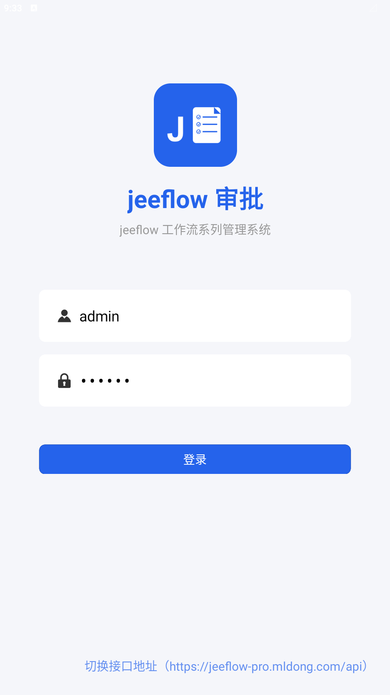
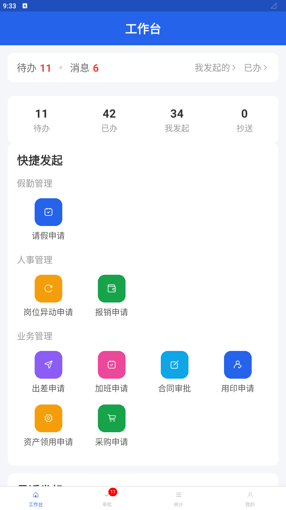
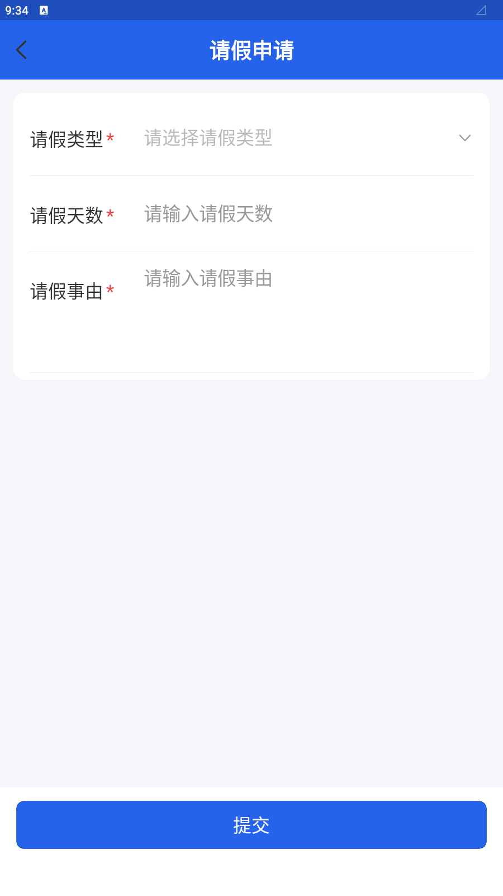
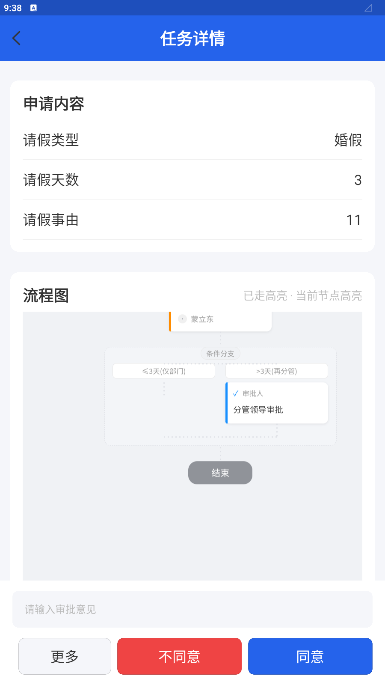
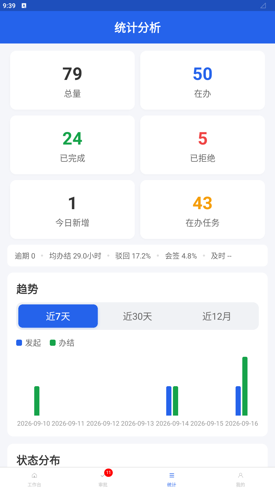

# uni-jeeflow-app

[](./LICENSE)
[](https://uniapp.dcloud.net.cn/uni-app-x/)
[](https://www.pgyer.com/jeeflowshenpi)

[jeeflow](https://jeeflow-doc.mldong.com) 工作流系列 · **移动审批端**（uni-app x）。

对接 mldong 八栈 jeeflow 集成后端的统一 API 契约（`/sys/**` + `/wf/{action}` facade），覆盖登录、待办/已办/抄送、发起、审批、撤回、实例详情（时间线 + 流程图）、委托代理、消息中心与工作台快捷发起。

演示站：[jeeflow-pro](https://jeeflow-pro.mldong.com) · 文档：[jeeflow-doc](https://jeeflow-doc.mldong.com)

---

## 下载体验（免编译）

Android 体验包：[蒲公英 · jeeflow审批](https://www.pgyer.com/jeeflowshenpi)（打开链接扫码或直接安装；默认连 pro 演示站，账号 `admin` / `123456`）。

功能总览、从源码运行、表单分发等技术说明见文档站：[用户指南 14 · uni-jeeflow-app](https://jeeflow-doc.mldong.com/guides/14-uni-jeeflow-app.html)。

想改代码 / 自行打包 → 看[快速开始](#快速开始)。

## 功能概览

| 模块 | 说明 |
|------|------|
| 登录 | 账号密码；登录页可切换接口地址（默认 pro 线上） |
| 工作台 | 待办/消息角标；快捷发起（`processDesign/listByType`）；四小指标（待办/已办/我发起/抄送，走分页接口 recordCount） |
| 审批中心 | 待办 / 已办 / 抄送 |
| 统计 | 分析页接引擎 stats 三 action 真数据：指标卡/趋势（7天/30天/12月）/状态分布/流程 Top 10/当前积压节点与积压人 |
| 发起 | 动态表单：自定义组件（如 LeaveWfForm）或 SchemaWfForm（`__schema__` → `getByTableName`） |
| 任务/实例 | 同意/拒绝、撤回、审批记录、钉钉风格流程图（mldong-flow-designer-dingtalk） |
| 我的 | 委托代理 CRUD、退出登录 |
| 消息 | 列表 / 详情 / 已读 / tab 角标 |

## 应用截图

| | |
|---|---|
| **登录（默认连 pro 演示站）** | **工作台（快捷发起 + 角标）** |
|  |  |
| **发起（动态表单）** | **审批（流程图条件分支高亮）** |
|  |  |
| **统计分析（引擎 stats 真数据）** | |
|  | |

## 技术栈

- **uni-app x**（`.uvue` / `.uts`，无 npm 依赖树）
- 编译与真机调试：**HBuilderX**（CLI `launch app-android`）
- 默认联调：`https://jeeflow-pro.mldong.com/api`（可在登录页切换）

## 快速开始

1. 安装 [HBuilderX](https://www.dcloud.io/hbuilderx.html)（含 uni-app x 插件）
2. **使用自定义调试基座**（包名 `com.mldong.jeeflow`，桌面名「jeeflow审批」）——**不要用 standard 公共基座**（图标/名称仍是 HBuilder）
3. 签名证书自备（HBuilderX 云打包证书或本地 keystore 均可；**证书文件不入库**）
4. 运行：

```bash
# 设备上若尚无自定义基座，先安装打包产物
adb -s 127.0.0.1:5555 install -r unpackage/debug/android_debug.apk

# 反向代理（HX sync + 本机 API 时按需加端口）
adb -s 127.0.0.1:5555 reverse tcp:8001 tcp:8001
adb -s 127.0.0.1:5555 reverse tcp:8000 tcp:8000

# 必须 --playground custom（与 .hbuilderx/launch.json 一致）
cli.exe launch app-android \
  --project <本仓绝对路径> \
  --deviceId 127.0.0.1:5555 \
  --playground custom
```

5. 默认账号（演示环境）：`admin` / `123456`

## 表单分发（对齐 vben5-wf）

与 Web 端同一套流程定义，只是表现层不同：

```
instanceUrl = jsonObject.instanceUrl
├─ 已注册自定义（如 LeaveWfForm）→ 本地命名 FormSchema
├─ SchemaWfForm
│    ├─ 有 __schema__ → 按列渲染
│    └─ 否则 getByTableName(processDefine.name)
└─ 未注册 → 明确失败（不按 defineName 偷换表单）
```

## 目录结构

```
api/           # sys / wf / schema / message / file
components/    # m-schema-form、m-timeline、m-flow-webview …
pages/         # 登录、工作台、审批、消息、我的、发起/任务/实例
util/          # http、表单 schema、角标、icon 映射
static/html/   # 钉钉流程图页（flow-designer-dingtalk + Vue）
```

## 相关仓库

| 仓库 | 说明 |
|------|------|
| [jeeflow-doc](https://github.com/mldong/jeeflow-doc) | 引擎规范与文档站 |
| [jeeflow-go](https://github.com/mldong/jeeflow-go) 等 | 多语言引擎实现 |
| mldong-vben5（feature/wf） | Web 管理端（表单/设计器契约对照） |

## 开源协议

[Apache License 2.0](./LICENSE)

## 反馈

移动端视角的后端兼容问题请提 [GitHub Issues](https://github.com/mldong/uni-jeeflow-app/issues)。本仓不直接改八栈集成后端代码。
